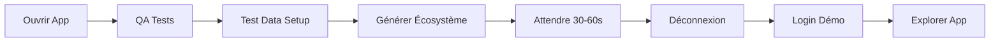

# 🎮 Squad Planner - Système de Démonstration

Bienvenue dans le système de démonstration de Squad Planner ! Ce système génère automatiquement un écosystème complet de données gaming pour tester et présenter l'application.

---

## 🚀 Démarrage Ultra-Rapide

**Temps total: 3 minutes**

1. **Générer** → QA Tests → Test Data Setup → "Générer l'écosystème"
2. **Login** → `shadow.ninja@squadplanner.demo` / `Demo1234!`
3. **Explorer** → Squads, Sessions, Profil, Stats

[Guide complet en 3 minutes →](QUICK_START_DEMO.md)

---

## 📚 Documentation Disponible

### 🎯 Pour Commencer
| Document | Durée | Description |
|----------|-------|-------------|
| **[QUICK_START_DEMO.md](QUICK_START_DEMO.md)** | 3 min | Guide ultra-rapide avec scénario de démo |
| **[HOW_TO_GENERATE_DEMO.md](HOW_TO_GENERATE_DEMO.md)** | 10 min | Guide pas-à-pas complet avec troubleshooting |

### 📖 Pour Approfondir
| Document | Type | Description |
|----------|------|-------------|
| **[DEMO_PROFILES.md](DEMO_PROFILES.md)** | Référence | Liste complète des 18 profils avec détails |
| **[DEMO_ECOSYSTEM_README.md](DEMO_ECOSYSTEM_README.md)** | Technique | Architecture et cas d'usage |
| **[IMPLEMENTATION_SUMMARY.md](IMPLEMENTATION_SUMMARY.md)** | Dev | Résumé technique d'implémentation |

---

## 🎮 Contenu de l'Écosystème

### En Chiffres
```
18  Profils gaming avec avatars et biographies
7   Squads actives (Valorant, Overwatch, Apex, LoL)
40-80 Sessions (passées et futures avec RSVP)
6   Types de badges débloquables
90  Entrées d'activité pour feed social
```

### Profils Vedettes
```
✨ MysticSage      97% fiabilité  45 sessions  🎯 Badge Fiable
✨ StarGuardian    96% fiabilité  43 sessions  🎯 Badge Fiable  
✨ ShadowNinja     95% fiabilité  42 sessions  🎯 Badge Fiable
✨ CrystalMage     94% fiabilité  41 sessions  ⭐ Badge Vétéran
```

### Squads Populaires
```
🎯 Les Valorant Tryharders    5 membres  Compétitif
🎮 Overwatch Legends          4 membres  Chill & Fun
🔥 Apex Predators             4 membres  Grind quotidien
🎤 LoL Ranked Squad           4 membres  Ranked & Clash
```

---

## 💡 Cas d'Usage

### 🎬 Démos Clients
```bash
Temps: 5 minutes
Profil: mystic.sage@squadplanner.demo (97% fiabilité)
Focus: Squads actives, Sessions confirmées, Badges impressionnants
```
[Scénario détaillé →](QUICK_START_DEMO.md#-scénario-de-démo-5-minutes)

### 🧪 Tests QA
```bash
Utilisateurs: 18 profils avec stats variées (72%-97%)
Squads: 7 configurations différentes
Sessions: Passées et futures pour tester tous les flows
```
[Guide tests →](HOW_TO_GENERATE_DEMO.md#pour-tester-les-fonctionnalités-sociales)

### 📸 Screenshots Marketing
```bash
Profils: Top performers avec badges (95%+)
Squads: Visuellement variées (différents jeux)
Sessions: Interface remplie naturellement
```
[Conseils screenshots →](DEMO_ECOSYSTEM_README.md#3-screenshots-marketing)

### 🎓 Développement
```bash
Données: Écosystème complet pour développer features
Patterns: Sessions régulières pour IA/suggestions
Historique: 2+ mois de données pour analytics
```
[Architecture technique →](DEMO_ECOSYSTEM_README.md#-architecture-technique)

---

## 🔑 Identifiants de Connexion

### Mot de Passe Universel
```
Demo1234!
```

### Profils Recommandés
```
📧 shadow.ninja@squadplanner.demo     (95% - 2 squads - Valorant)
📧 mystic.sage@squadplanner.demo      (97% - 2 squads - Support)
📧 phoenix.rising@squadplanner.demo   (88% - 2 squads - Équilibré)
📧 iron.titan@squadplanner.demo       (91% - 2 squads - Overwatch)
📧 thunder.god@squadplanner.demo      (89% - 2 squads - LoL)
```

[Liste complète des 18 profils →](DEMO_PROFILES.md)

---

## 🛠️ Fonctionnalités Techniques

### Génération Automatique
- ✅ 18 utilisateurs Supabase Auth
- ✅ Profils KV store avec stats
- ✅ 7 squads avec membres assignés
- ✅ 40-80 sessions avec RSVP complets
- ✅ Badges attribués selon performances
- ✅ Historique d'activité social

### Performance
- ⏱️ **Génération:** 30-60 secondes
- 💾 **Espace DB:** ~125-205 KB
- 🔄 **Idempotence:** Peut être régénéré
- 🗑️ **Cleanup:** Manuel via Supabase

### Sécurité
- ⚠️ **Environnement de démo uniquement**
- ⚠️ **Mot de passe simple volontaire**
- ⚠️ **Domaine .demo fictif**
- ⚠️ **Ne PAS utiliser en production**

---

## 📍 Accès à l'Interface

### Via QA Tests (Recommandé)
```
1. Profil (onglet du bas)
2. Developer Tools section
3. 🧪 QA Tests
4. 🧪 Test Data Setup
```

### Via URL Directe
```
Navigation: #/test-setup
Command Palette: Cmd+K → "Test Setup"
```

---

## 🎯 Workflow Complet



---

## ❓ FAQ Rapide

**Q: Combien de profils sont créés?**
→ 18 profils gaming avec données complètes

**Q: Puis-je personnaliser la génération?**
→ Pas actuellement, c'est un ensemble prédéfini

**Q: Les données persistent-elles?**
→ Oui, jusqu'à suppression manuelle via Supabase

**Q: Puis-je ajouter mes propres profils après?**
→ Oui, ils coexisteront avec les profils de démo

**Q: Comment supprimer les données de démo?**
→ Manuellement via Supabase (filtrer par @squadplanner.demo)

[FAQ complète →](HOW_TO_GENERATE_DEMO.md#-troubleshooting)

---

## 🔗 Navigation Rapide

| Besoin | Document |
|--------|----------|
| 🚀 Commencer maintenant | [QUICK_START_DEMO.md](QUICK_START_DEMO.md) |
| 📖 Guide complet | [HOW_TO_GENERATE_DEMO.md](HOW_TO_GENERATE_DEMO.md) |
| 👥 Liste des profils | [DEMO_PROFILES.md](DEMO_PROFILES.md) |
| 🏗️ Architecture | [DEMO_ECOSYSTEM_README.md](DEMO_ECOSYSTEM_README.md) |
| 💻 Implémentation | [IMPLEMENTATION_SUMMARY.md](IMPLEMENTATION_SUMMARY.md) |

---

## 🎉 Résultat Final

Après génération, vous avez une application Squad Planner **100% fonctionnelle** :

```
✅ Écrans de squads remplis
✅ Sessions avec historique
✅ Profils avec stats réelles
✅ Badges débloqués
✅ Feed social actif
✅ Patterns pour IA
✅ Prêt pour démos pro
```

---

## 🚀 Actions Rapides

| Action | Commande |
|--------|----------|
| **Générer** | QA Tests → Test Data Setup → Générer |
| **Login Démo** | shadow.ninja@squadplanner.demo / Demo1234! |
| **Voir Squads** | Onglet Squads → 7 squads disponibles |
| **Voir Stats** | Profil → Stats & Badges |
| **Documentation** | Ouvrir QUICK_START_DEMO.md |

---

## 📞 Support

- 📖 Documentation complète dans les fichiers MD
- 🐛 Troubleshooting: [HOW_TO_GENERATE_DEMO.md](HOW_TO_GENERATE_DEMO.md)
- 💡 Cas d'usage: [DEMO_ECOSYSTEM_README.md](DEMO_ECOSYSTEM_README.md)
- 💻 Technique: [IMPLEMENTATION_SUMMARY.md](IMPLEMENTATION_SUMMARY.md)

---

**Version:** 1.0.0 | **Status:** ✅ Production Ready | **Janvier 2026**

Made with ❤️ by Squad Planner Team

---

**Next Steps:**
1. Lire [QUICK_START_DEMO.md](QUICK_START_DEMO.md) (3 minutes)
2. Générer l'écosystème
3. Explorer avec les profils de démo
4. Profiter de l'application remplie ! 🎮
